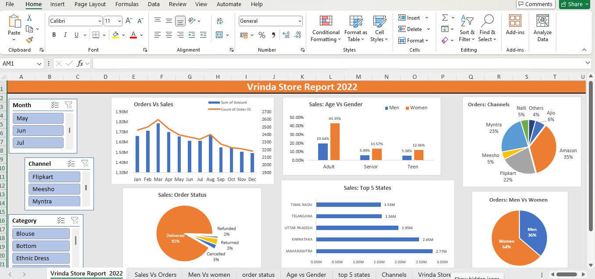

# 📊 Sales and Customer Behavior Analysis Dashboard  

## 📌 Project Overview  
This project analyzes store sales trends and customer behavior using **Microsoft Excel**. The goal is to identify key sales patterns, understand customer purchasing behavior, and generate actionable insights to improve business decisions.  

## 📂 Dataset  
- **Source:** [Vrinda Store sales data (Excel file)] (https://docs.google.com/spreadsheets/d/1N_Aa45UnkPmnwGqNr6oTzvUhb5TKlitM/edit?gid=1081836936#gid=1081836936)
  
- **Data Fields:**  
  - Order Id
  - Customer ID  
  - Gender 
  - Age  
  - Date
  - Status
  - Channel
  - SKU
  - Category
  - Size
  - Qty
  - Currency
  - Amount
  - Ship-city

## 🎯 Objectives  
- Analyze sales **trends and patterns** over time.  
- Identify **peak sales periods** and slow seasons.  
- Study **customer behavior**, including purchasing preferences.  
- Provide data-driven insights for better decision-making.  

## 🛠️ Tools Used  
- **Microsoft Excel**  
  - Pivot Tables & Charts  
  - Conditional Formatting  
  - Data Cleaning & Transformation  
  - Statistical Analysis Functions  
  - Dashboard Design  

## 📈 Key Insights  
1. **Sales Trends:** Identified best-performing months and peak sales days.  
2. **Customer Preferences:** Determined the most popular products and payment methods.  
3. **Peak Shopping Hours:** Found out when customers are most active.  

## 📸 Dashboard Preview  

